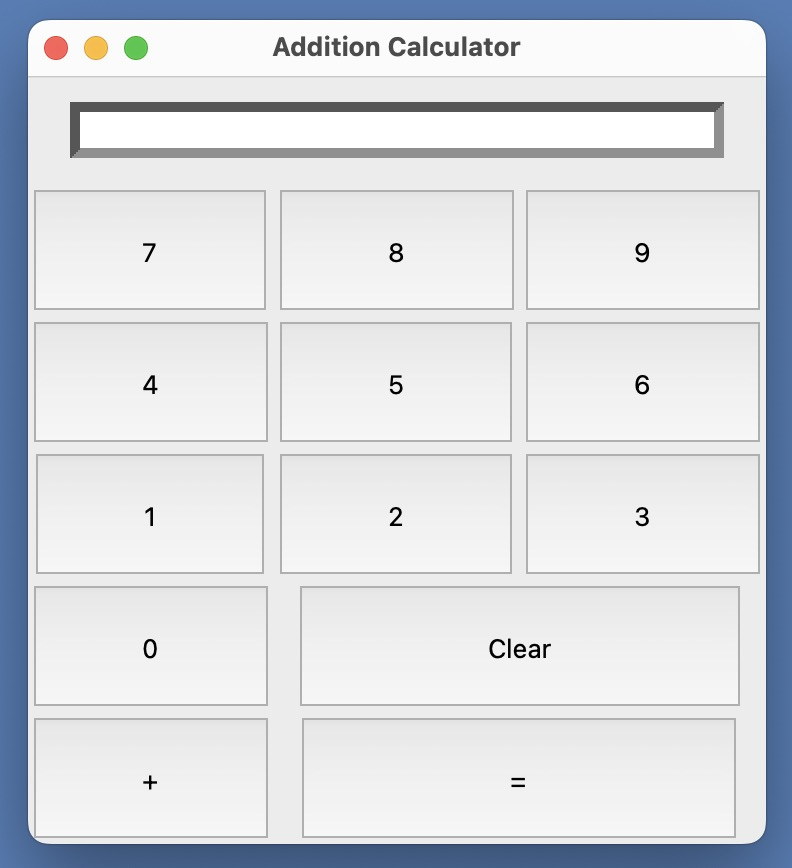

# Addition Calculator

### Overview
Base 10 addition calculator using Python 3 and Tkinter.

### Background
Primarily followed tutorial with individual additions. Tutorial found [here](https://www.youtube.com/watch?v=YXPyB4XeYLA).

### Implementation
Presented calculator using Tkinter grid functionality for all buttons to mimic a real calculator. Number inputs are via button presses and the current input is displayed in a text field. This calculator has the ability to add as many numbers together of any length. Calculator GUI includes buttons for all ten digits (0-9), an addition button "+", an equals button "=", and a clear button "Clear".

### Running the program:
1. Download `Python 3`  
2. Download `addition_calculator.py`  
3. Navigate to the addition_calculator.py directory  
4. Run `Python3 addition_calculator.py`  
5. Close window when finished  

### Interface

